# ETL Pipeline Design - Amazon Sales & Electronics Data Warehouse

## 📊 Overview Pipeline Architecture

```mermaid
graph TB
    subgraph EXTRACT["🔍 EXTRACT PHASE"]
        E1[PostgreSQL<br/>Amazon Sales Data]
        E2[CSV File<br/>Electronics Products]
        E3[Web Scraping<br/>Detik.com Articles]
    end
    
    subgraph TRANSFORM["⚙️ TRANSFORM PHASE"]
        T1[Sales Data Cleaning]
        T2[Products Data Cleaning]
        T3[NLP Data Cleaning]
    end
    
    subgraph LOAD["📥 LOAD PHASE"]
        L1[Create DW Schema]
        L2[Load dim_date]
        L3[Load dim_products]
        L4[Load fact_sales]
        L5[Load nlp_training_data]
    end
    
    E1 --> T1
    E2 --> T2
    E3 --> T3
    
    T1 --> L4
    T2 --> L3
    T3 --> L5
    
    L1 --> L2
    L1 --> L3
    L1 --> L4
    L1 --> L5
    
    L2 --> L4
```



---

## 🔍 PHASE 1: EXTRACT

### 1.1 Extract Sales Data (PostgreSQL)

**Source:** PostgreSQL Database → `amazon_sales_data` table

**Process Flow:**


**Validation Checks:**
- ✅ Database connection successful
- ✅ Query execution without errors
- ✅ Data rows > 0
- ✅ File saved successfully
- ✅ Session flag created

**Output:** `Data Source/raw_SalesData.csv`

---

### 1.2 Extract Products Data (CSV)

**Source:** CSV File → `ElectronicsProductsPricingData.csv`

**Process Flow:**


**Validation Checks:**
- ✅ Source file exists
- ✅ File readable (valid CSV format)
- ✅ Columns present
- ✅ Data shape logged
- ✅ Session flag created

**Output:** `Data Source/raw/products_raw.csv`

---

### 1.3 Extract Detik Articles (Web Scraping)

**Source:** Website → `https://www.detik.com/tag/ai/`

**Process Flow:**


**Validation Checks:**
- ✅ HTTP response status 200
- ✅ BeautifulSoup parsing successful
- ✅ Articles found on page
- ✅ Required fields (judul, url) not empty
- ✅ Retry mechanism on timeout (3x with 5s/10s/15s backoff)
- ✅ Stop on 3 consecutive timeouts
- ✅ Session flag created

**Output:** `Data Source/raw/reviews_raw.csv`

---

## ⚙️ PHASE 2: TRANSFORM

### 2.1 Transform Sales Data

**Input:** `raw_SalesData.csv`  
**Output:** `Data Source/cleaned/sales_cleaned.csv`

**Process Flow:**


**Detailed Validation & Cleaning Steps:**

| Step | Field | Actions | Validation |
|------|-------|---------|------------|
| 1 | Unnamed Columns | Drop all `Unnamed:*` columns | ✅ Columns cleaned |
| 2 | `name` | Fill NA with 'Unknown Product'<br/>Strip whitespace<br/>Replace empty with 'Unknown Product' | ✅ No nulls<br/>✅ No empty strings |
| 3 | `main_category`<br/>`sub_category` | Fill NA with 'Uncategorized'/'General' | ✅ No nulls |
| 4 | `ratings` | Convert to numeric<br/>Fill NA with 0.0<br/>Cap between 0-5 | ✅ Numeric type<br/>✅ Range [0, 5] |
| 5 | `no_of_ratings` | Convert to numeric<br/>Fill NA with 0<br/>Convert to integer | ✅ Integer type<br/>✅ No nulls |
| 6 | `discount_price`<br/>`actual_price` | Remove ₹ symbol and commas<br/>Convert to float<br/>Fill missing with counterpart<br/>Calculate discount % | ✅ Numeric type<br/>✅ Cross-validation<br/>✅ Discount % calculated |
| 7 | `image`<br/>`link` | Fill NA with empty string | ✅ No nulls |
| 8 | Duplicates | Remove duplicates on (`name`, `link`) | ✅ Count logged<br/>✅ Keep='first' |
| 9 | Critical Missing | Drop rows where `name` is null | ✅ No critical nulls |

**Data Quality Checks:**
- ✅ **Missing Values:** All handled with appropriate defaults
- ✅ **Data Types:** Correct types enforced
- ✅ **Duplicates:** Removed based on business key
- ✅ **Range Validation:** Ratings 0-5, prices non-negative
- ✅ **Referential Integrity:** Discount ≤ Actual price

**Output Statistics:**
- Final shape reported
- Unique categories count
- Average rating
- Average price

---

### 2.2 Transform Products Data

**Input:** `raw/products_raw.csv`  
**Output:** `Data Source/cleaned/products_cleaned.csv`

**Process Flow:**


**Detailed Validation & Cleaning Steps:**

| Step | Field | Actions | Validation |
|------|-------|---------|------------|
| 1 | Unnamed Columns | Drop all `Unnamed:*` columns | ✅ Columns cleaned |
| 2 | `name` | Fill NA with 'Unknown Product'<br/>Strip whitespace | ✅ No nulls<br/>✅ Trimmed |
| 3 | `brand`<br/>`manufacturer` | Fill NA with 'Unknown'<br/>Manufacturer defaults to brand | ✅ No nulls<br/>✅ Logical defaults |
| 4 | `prices.amountMin`<br/>`prices.amountMax` | Convert to numeric<br/>Fill missing with counterpart<br/>Fill remaining with 0<br/>Ensure Max ≥ Min<br/>Calculate average | ✅ Numeric type<br/>✅ Range validated<br/>✅ Average calculated |
| 5 | `prices.currency` | Fill NA with 'USD'<br/>Uppercase<br/>Strip whitespace | ✅ Standardized format |
| 6 | `prices.availability` | Fill NA with 'Unknown' | ✅ No nulls |
| 7 | `prices.condition` | Fill NA with 'New'<br/>Title case | ✅ Standardized format |
| 8 | `prices.isSale` | Fill NA with False | ✅ Boolean type |
| 9 | `categories`<br/>`primaryCategories` | Fill NA with 'Uncategorized'<br/>Primary defaults to categories | ✅ No nulls |
| 10 | Duplicates | Remove duplicates on (`name`, `brand`) | ✅ Count logged |
| 11 | Empty Rows | Drop completely empty rows | ✅ No all-null rows |

**Data Quality Checks:**
- ✅ **Missing Values:** All handled
- ✅ **Data Types:** Enforced (numeric, boolean, string)
- ✅ **Duplicates:** Removed by business key
- ✅ **Range Validation:** Max ≥ Min prices
- ✅ **Standardization:** Currency uppercase, condition title case

**Output Statistics:**
- Final shape
- Unique brands count
- Average price

---

### 2.3 Transform Reviews Data (NLP Training)

**Input:** `raw/reviews_raw.csv`  
**Output:** `Data Source/cleaned/reviews_cleaned.csv`

**Process Flow:**


**Detailed Validation & Cleaning Steps:**

| Step | Field | Actions | Validation |
|------|-------|---------|------------|
| 1 | All | Drop completely empty rows | ✅ Count logged |
| 2 | `judul` | Fill NA with empty string<br/>Strip whitespace<br/>Replace multiple spaces with single<br/>Remove newlines/tabs | ✅ Normalized text |
| 3 | `deskripsi` | Fill NA with empty string<br/>Strip whitespace<br/>Replace multiple spaces<br/>Remove newlines/tabs | ✅ Normalized text |
| 4 | `tanggal_artikel` | Fill NA with empty string<br/>Strip whitespace | ✅ No nulls |
| 5 | `scraped_date` | Parse to datetime<br/>Fill errors with current datetime | ✅ Datetime type |
| 6 | `url` | Fill NA with empty string<br/>Strip whitespace | ✅ No nulls |
| 7 | `category` | Fill NA with 'Uncategorized'<br/>Strip whitespace<br/>Remove 'detik' prefix<br/>Replace empty with 'Uncategorized' | ✅ Standardized |
| 8a | Duplicates (URL) | Remove duplicates on `url` | ✅ URL duplicates logged |
| 8b | Duplicates (Title) | Remove duplicates on `judul` | ✅ Title duplicates logged |
| 9 | Invalid Records | Remove rows where `judul` is empty | ✅ Count logged |
| 10 | `article_id` | Reset sequential ID (1, 2, 3...) | ✅ Unique IDs |

**Text Cleaning Regex:**
- `\s+` → Single space (collapse multiple spaces)
- `[\r\n\t]` → Space (remove line breaks, tabs)

**Data Quality Checks:**
- ✅ **Missing Values:** All handled
- ✅ **Text Normalization:** Whitespace, special chars cleaned
- ✅ **Duplicates:** Removed by URL and title
- ✅ **Data Integrity:** No records without title
- ✅ **DateTime Parsing:** Scraped date in proper format

**Output Statistics:**
- Final shape
- Category distribution (value_counts)
- Columns list

---

## 📥 PHASE 3: LOAD

### 3.1 Create Data Warehouse Schema

**Task:** `CreateWarehouseTables`

**Process Flow:**


**Schema Design:**

| Table | Type | Purpose | Primary Key | Foreign Keys | Unique Constraints |
|-------|------|---------|-------------|--------------|-------------------|
| `etl_log` | Metadata | Track incremental loads | `log_id` (SERIAL) | - | - |
| `dim_date` | Dimension | Date dimension (2 years) | `date_id` (SERIAL) | - | `full_date` |
| `dim_products` | Dimension | Electronics catalog | `product_id` (SERIAL) | - | - |
| `fact_sales` | Fact | Amazon sales transactions | `sale_id` (SERIAL) | `date_id` → dim_date | `(product_name, product_link)` |
| `nlp_training_data` | Training | NLP articles | `text_id` (SERIAL) | - | `url` |

**Indexes Created:**
- `dim_date`: full_date, (year, month)
- `dim_products`: brand, sub_category
- `fact_sales`: date_id, main_category, ratings
- `nlp_training_data`: category

**Validation Checks:**
- ✅ All 5 tables created
- ✅ Indexes created
- ✅ Foreign keys configured
- ✅ Unique constraints set (for UPSERT)

---

### 3.2 Load Date Dimension

**Task:** `LoadDimDate`

**Process Flow:**


**Date Attributes Generated:**
- `full_date` (DATE, unique)
- `year`, `month`, `day`
- `quarter` (1-4)
- `day_of_week` (0-6)
- `day_name` (Monday, Tuesday...)
- `month_name` (January, February...)
- `is_weekend` (TRUE/FALSE)

**Validation Checks:**
- ✅ 2 years = ~730 dates generated
- ✅ No duplicates on full_date
- ✅ All attributes calculated
- ✅ Bulk insert successful

---

### 3.3 Load Products Dimension

**Task:** `LoadDimProducts`

**Input:** `cleaned/products_cleaned.csv`

**Process Flow:**


**Column Mapping:**

| Source CSV | DW Column | Transformation |
|------------|-----------|----------------|
| `name` | `product_name` | Fill NA → 'Unknown Product' |
| `brand` | `brand` | Fill NA → 'Unknown Brand' |
| `manufacturer` | `manufacturer` | Fill NA → 'Unknown' |
| `categories` | `main_category` | Fill NA → 'Uncategorized' |
| `primaryCategories` | `sub_category` | Fill NA → 'Uncategorized' |
| `prices.amountMin` | `prices_min` | Fill NA → 0 |
| `prices.amountMax` | `prices_max` | Fill NA → 0 |
| `prices.average` | `prices_average` | Fill NA → 0 |
| `prices.currency` | `prices_currency` | Fill NA → 'USD' |
| `prices.availability` | `availability` | Fill NA → 'Unknown' |
| `prices.condition` | `condition` | Fill NA → 'Unknown' |

**Validation Checks:**
- ✅ Schema verified
- ✅ Before/after count logged
- ✅ UPSERT logic (skip existing, insert new)

---

### 3.4 Load Sales Fact Table

**Task:** `LoadFactSales`

**Input:** `cleaned/sales_cleaned.csv`

**Process Flow:**


**UPSERT Logic:**
```sql
-- Create temp table
CREATE TEMP TABLE temp_sales AS SELECT * FROM new_data;

-- Insert only new records (ON CONFLICT DO NOTHING)
INSERT INTO fact_sales (columns...)
SELECT * FROM temp_sales
ON CONFLICT (product_name, product_link) DO UPDATE SET
    discount_price = EXCLUDED.discount_price,
    actual_price = EXCLUDED.actual_price,
    ratings = EXCLUDED.ratings,
    updated_at = CURRENT_TIMESTAMP;

DROP TABLE temp_sales;
```

**Column Mapping & Validation:**

| Source | DW Column | Validation |
|--------|-----------|------------|
| `name` | `product_name` | Fill NA → 'Unknown' |
| `main_category` | `main_category` | Fill NA → 'Uncategorized' |
| `sub_category` | `sub_category` | Fill NA → 'General' |
| Random | `date_id` | FK to dim_date |
| `discount_price` | `discount_price` | Numeric, cap to 9,999,999,999,999.99 |
| `actual_price` | `actual_price` | Numeric, cap to 9,999,999,999,999.99 |
| `discount_percentage` | `discount_percentage` | Numeric, cap to 999.99 |
| `ratings` | `ratings` | Numeric, cap to 5.00 |
| `no_of_ratings` | `no_of_ratings` | Integer |
| `image` | `image_url` | Text |
| `link` | `product_link` | Text |

**Validation Checks:**
- ✅ Before/after count comparison
- ✅ New records count logged
- ✅ Price range validated (0 to max DECIMAL)
- ✅ Ratings capped (0-5)
- ✅ ETL log updated
- ✅ UPSERT prevents duplicates

---

### 3.5 Load NLP Training Data

**Task:** `LoadNLPTrainingData`

**Input:** `cleaned/reviews_cleaned.csv`

**Process Flow:**


**UPSERT Logic:**
```sql
-- Create temp table
CREATE TEMP TABLE temp_nlp AS SELECT * FROM new_data;

-- UPSERT on url (unique constraint)
INSERT INTO nlp_training_data (columns...)
SELECT * FROM temp_nlp
ON CONFLICT (url) DO UPDATE SET
    judul = EXCLUDED.judul,
    deskripsi = EXCLUDED.deskripsi,
    category = EXCLUDED.category,
    updated_at = CURRENT_TIMESTAMP;

DROP TABLE temp_nlp;
```

**Column Mapping:**

| Source | DW Column | Validation |
|--------|-----------|------------|
| `article_id` | `article_id` | Integer |
| `judul` | `judul` | Not empty |
| `deskripsi` | `deskripsi` | Text |
| `category` | `category` | Text |
| `url` | `url` | Unique constraint |
| `tanggal_artikel` | `tanggal_artikel` | Text |
| `scraped_date` | `scraped_date` | Datetime |

**Validation Checks:**
- ✅ Empty titles filtered out
- ✅ Before/after count logged
- ✅ New records count logged
- ✅ ETL log updated
- ✅ UPSERT by URL (unique constraint)

---

## 🔄 Pipeline Execution & Dependencies

**Luigi Task Dependency Graph:**


---

## ✅ Complete Data Quality Checklist

### Extract Phase
- [ ] Database connections successful
- [ ] Source files exist and readable
- [ ] Web scraping retry mechanism working
- [ ] Session flags created for idempotency
- [ ] Raw data saved successfully

### Transform Phase  
- [ ] Missing values handled appropriately
- [ ] Data types enforced correctly
- [ ] Duplicates removed by business keys
- [ ] Range validation applied (ratings, prices)
- [ ] Text normalization completed
- [ ] Logical defaults applied
- [ ] Cross-field validation (min ≤ max)
- [ ] Cleaned data saved successfully

### Load Phase
- [ ] Warehouse schema created with constraints
- [ ] Indexes created for performance
- [ ] Dimension tables populated
- [ ] Fact tables populated
- [ ] UPSERT logic working correctly
- [ ] Foreign key integrity maintained
- [ ] ETL log updated
- [ ] Before/after counts validated

---

## 🎯 Key Features

### 1. **Idempotency**
- Session flags prevent duplicate runs
- UPSERT prevents duplicate inserts
- `complete()` methods check both file AND flag

### 2. **Data Quality**
- **Missing Values:** All handled with business-appropriate defaults
- **Duplicates:** Removed at transform phase
- **Type Safety:** Enforced conversions with error handling
- **Range Validation:** Prices, ratings capped to valid ranges

### 3. **Incremental Loading**
- UPSERT on unique constraints
- Only new records inserted on subsequent runs
- ETL log tracks run history

### 4. **Error Handling**
- Retry logic for web scraping (3x with backoff)
- Timeout handling for unstable connections
- FileNotFoundError handling
- Database connection error handling

### 5. **Observability**
- Detailed logging at each step
- Before/after counts
- Data quality statistics reported
- Execution flags for tracking

---

## 📈 Data Quality Metrics

| Metric | Location | Purpose |
|--------|----------|---------|
| Row count before/after | All transforms | Validate data loss |
| Duplicate count | Transform phase | Track cleaning effectiveness |
| Missing value handling | Transform phase | Ensure completeness |
| Category distribution | Reviews transform | Validate NLP data balance |
| Price range | Sales/Products | Detect outliers |
| Average rating | Sales transform | Quick quality check |
| New records count | Load phase | Track incremental growth |

---

## 🚀 Execution

```bash
# Full pipeline
python main.py

# Individual phases
python Task/extract.py  # Extract only
python Task/transform.py  # Transform only
python Task/load.py  # Load only
```

---

**Created:** 2026-02-17  
**Pipeline Version:** 1.0  
**Author:** ETL Team
